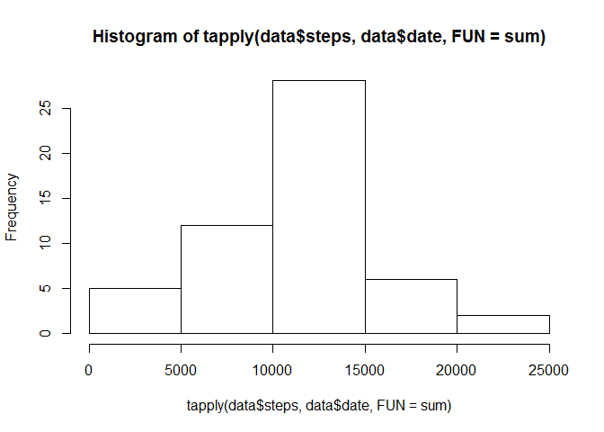
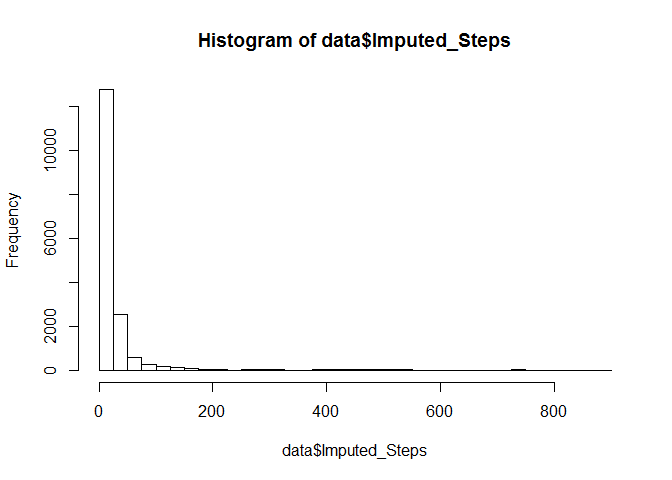
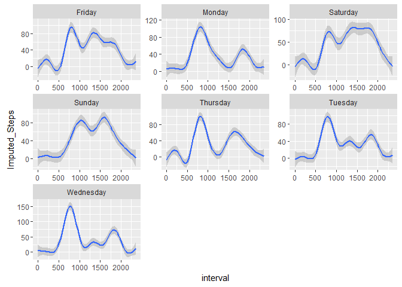

# Reproducible Research: Peer Assessment 1

## 1. Loading and preprocessing the data

Here is a code for reading and processing the activity monitoring data.


```r
setwd("c:/users/rwood/documents/work")
download.file("https://d396qusza40orc.cloudfront.net/repdata%2Fdata%2Factivity.zip", "Activity Data.zip")
data <- read.csv(unz("Activity Data.zip", "activity.csv"))
data <- transform(data, steps = as.numeric(steps))
```

## 2. What is the mean total number of steps taken per day?

Here is a code for finding the sum of steps taken each day and making a histogram


```r
hist(tapply(data$steps, data$date, FUN=sum))
```

<!-- -->

## 3. What is the average daily activity pattern?

Here is a code for finding the mean and median number of steps taken each day.


```r
datamean <- tapply(data$steps, data$date, FUN=mean)
summary(datamean)
```

```
##    Min. 1st Qu.  Median    Mean 3rd Qu.    Max.    NA's 
##  0.1424 30.7000 37.3800 37.3800 46.1600 73.5900       8
```

```r
datamedian <- tapply(data$steps, data$date, FUN=median)
summary(datamedian)
```

```
##    Min. 1st Qu.  Median    Mean 3rd Qu.    Max.    NA's 
##       0       0       0       0       0       0       8
```

Here is a code to plot each time interval (x axis) against average steps taken per interval for all days (y axis)


```r
x <- aggregate(steps ~ interval, data, sum)
  plot(x, type = "l")
```

<!-- -->

Here is a code to calculate the 5-minute interval that, on average, contains the maximum number of steps


```r
x$interval[match(max(x$steps), x$steps)]
```

```
## [1] 835
```

## 4. Imputing missing values

Here is a code to calculate and report the total number of rows with NAs


```r
sum(is.na(data$steps))
```

```
## [1] 2304
```

Here is a  code to impute the mean, based on a reference at this link: 

<https://cran.r-project.org/web/packages/imputeTS/imputeTS.pdf>. 

The method used is a moving average window that uses integer "k" to define the width of the moving window.

K expands to both sides of the center of the value, so if K=2 that mean 4 observations (2 left, 2 right) 
are taken into account.  For this question, I chose k = 1152 to represent a moving range of 4 days in either direction.  This is 12 intervals per hour x 24 hours per day x 4 days).  In the summary, there are no longer NA values in the new column called "Imputed Steps".


```r
library(imputeTS)
data <- cbind(data, (na.ma(data$steps, k = 1152, weighting = "linear")))
  names(data)[4]<-paste("Imputed_Steps")
  summary(data)
```

```
##      steps                date          interval      Imputed_Steps   
##  Min.   :  0.00   2012-10-01:  288   Min.   :   0.0   Min.   :  0.00  
##  1st Qu.:  0.00   2012-10-02:  288   1st Qu.: 588.8   1st Qu.:  0.00  
##  Median :  0.00   2012-10-03:  288   Median :1177.5   Median :  0.00  
##  Mean   : 37.38   2012-10-04:  288   Mean   :1177.5   Mean   : 36.41  
##  3rd Qu.: 12.00   2012-10-05:  288   3rd Qu.:1766.2   3rd Qu.: 29.60  
##  Max.   :806.00   2012-10-06:  288   Max.   :2355.0   Max.   :806.00  
##  NA's   :2304     (Other)   :15840
```

Here is a code to generate a histogram of the total number of steps taken each day after the missing values are imputed


```r
hist(data$Imputed_Steps, breaks=seq(0,900,by=25))
```

<!-- -->

##5. Are there differences in activity patterns between weekdays and weekends?

Here is a code to generate a panel plot comparing the average number of steps taken per 5-minute interval across weekdays and weekends


```r
data <- cbind(data, weekdays(as.Date(data$date)))
  names(data)[5]<-paste("Day")
    library(ggplot2)
      ggplot(data, aes(interval, Imputed_Steps)) + geom_smooth() + facet_wrap(~Day, scales = "free")
```

<!-- -->
